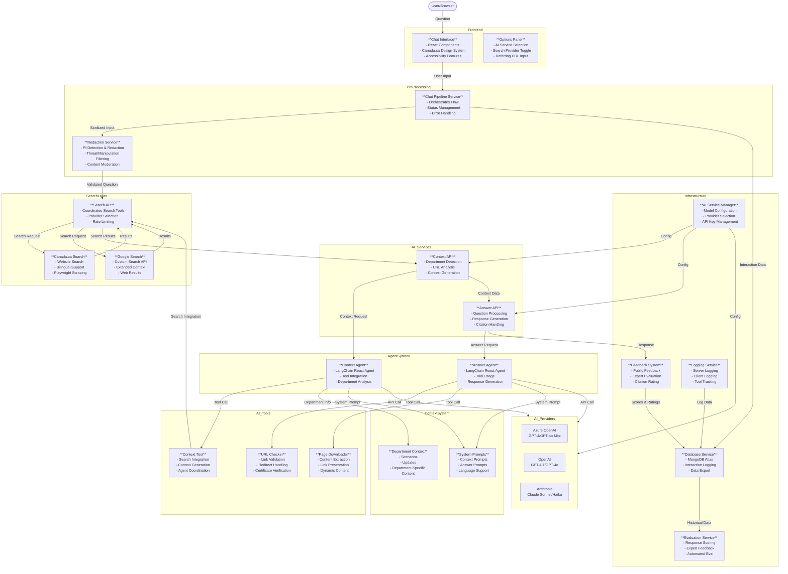

# AI Answers - Government of Canada AI Assistant

## System Card

### Overview
AI Answers is a specialized AI chat application designed exclusively for Government of Canada websites. It provides accurate, brief answers to user questions about government services, programs, and information, with a single citation to an official government source or next step of their task. An extensive Admin interface supports  evaluation, metrics, user management, and logging views.

### Purpose & Scope
- **Primary Function**: Assist users with questions about government services and programs.
- **Target Users**: visitors to Canada.ca
- **Content Scope**: Government of Canada services, programs, benefits, and official information only
- **Language Support**: Full official language support (English/French) and answers in most user languages (indigenous languages in the future)

### Key Capabilities
- **Context-Aware Responses**: Uses referral URLs and department detection to provide relevant answers
- **Citation System**: Every answer includes a single verified link to a federal government page
- **Privacy Protection**: Automatic PI redaction and content filtering 
- **Accessibility**: Screen reader tested and WCAG compliant
- **Evaluation-Driven**: Continuous improvement through expert and automated evaluation

### Technical Architecture
- **Frontend**: React-based chat interface with Canada.ca design system
- **Backend**: Node.js microservices with prompt-chaining architecture
- **AI Services**: Azure OpenAI GPT models (production), initial development testing with Anthropic Claude models
- **Database**: AWS DocumentDB (production) 
- **Deployment**: Azure cloud

### Safety & Compliance
- **Content Filtering**: Blocks inappropriate content, threats, and manipulation attempts
- **Rate Limiting**: 3 questions per session to prevent abuse
- **Character Limits**: 400 character limit per question
- **PI Protection**: No personal information sent to AI services or logged
- **Official Languages**: Compliant with Canadian official languages requirements

### Current Status
- **Environment**: Preparing for public pilot
- **Deployment**: Production environment at ai-answers.alpha.canada.ca
- **Evaluation**: Ongoing user feedback collection and response scoring

---

## Detailed Documentation

### Status 

- preparing for public pilot 

## 🌟 Key Features

### Tuned for Canada.ca user needs
   
- AI response is tagged so sentences in answer can be displayed in accessible canada.ca format and single citation url can be displayed for next step of task, with clickable link 
- assumes the AI service will be called from a specific canada.ca page, and uses the referral url to pass that information to the AI service. The referral url is either passed to the AI service from the chat interface for testing purposes, or from the query tag on the call of the application. The query tag is the url of the page that AI Answers is called from - it must be encoded properly.
- system prompt forces short answers of a maximum of 4 sentences to improve clarity, use plain language, and reduce risk of hallucinations.
- scenarios address top user issues, top task issues and general GC instructions for the AI service to answer the question accurately and provide a citation url for all answers sourced from canada.ca or gc.ca sites.
- takes advantage of canada.ca interaction patterns and support - e.g. if a wizard is already in place, direct the user to answer those questions rather than having the AI service attempt to answer. AI services aren't optimized for layers of question logic and aren't effective for that purpose.
- since GC pages are added and updated frequently, the AI agent uses the downloadWebPage tool to read the page if it identifies a new, updated or unfamiliar url (from the search results, the contextual scenario and update files, or the referral url)
- PI is redacted programmatically in the code, no PI is sent to the AI service or logged into the database. When PI is detected in the user question, the user is alerted that the question will not be sent to the AI service to protect their privacy, and that they should ask the question without private personal details.
- Threats,manipulation and obscenity redaction is also in place. Similar to PI, the user is alerted that the question will not be sent to the AI service, and that they should ask the question differently. Usability testing of this feature showed users were successful at understanding the instructions and asking the question without specific threat words.

### Official languages support

- Matches canada.ca spec with EN and FR official translated versions of the main AI Answers page
- Users can ask questions in any language on either page, but the citation url will be to an English canada.ca or gc.ca URL if the user is asking from the English AI Answers page, and to a French citation url if the user is asking from the French AI Answers page.
- Language selector also available in batch process
- Context service loads Canada.ca French menu structure and FR department and agency names and urls
- System prompt scenarios and updates all include English and French citation urls pairs when a scenario or example suggests a specific url be used for related questions
- All text displayed to users in JSON language files for easy updates and translations in the locales folder

### Independent of AI service provider

- original design was tested with two AI service providers for exploration of strengths and weaknesses of different models
- On this repo, only OpenAI GPT latest model is currently supported 
- Failover was in place, to switch to the other AI service if one fails - with only one service, will need to pull product out of service when ai performance is degraded or down. Setting to turn it off and display a message is provided in the Admin interface. 
- Prompt caching implemented to improve response quality and speed
- Temperature set to 0 for more deterministic responses for both models
- Conversation history management - pass conversation history to AI service for context in 'message' field
- Enhanced citation handling - the AI calls a tool to check if the citation url is valid and if not, finds another url, finally failing to a search link if no url is found
- System prompts optimized for 2025 model compatibility

### Innovative evaluation-driven design to target >95% answer accuracy
- **Expert Evaluation System**: 
  - **In-App Evaluation**: Experts evaluate questions within the actual app interface, in the same view as a user would experience
  - **Flexible Evaluation**: Experts can enter their own questions or use existing chat IDs to evaluate user conversations
  - **Sentence-Level Scoring**: Each sentence in AI responses is scored individually (100/80/0 points) with detailed explanations logged and embedded into the database for use by the AI
  - **Citation Rating**: Separate scoring for citation accuracy and relevance (25/20/0 points)
  - **Weighted Total Score**: 75% sentence scores + 25% citation score for comprehensive quality assessment
  - **Embedding Generation**: Expert feedback creates embeddings that enable automated AI evaluations for similar questions
  - **Future Enhancement**: These embeddings will soon assist in answering questions quickly and accurately
- **Separate Public User Feedback**: 
  - **Simple Interface**: "Was this helpful?" with Yes/No options for all users
  - **Detailed Follow-up**: Single question asking why they clicked Yes or No with specific reason options
  - **Positive Reasons**: No call needed, no visit needed, saved time, other
  - **Negative Reasons**: Irrelevant, confusing, not detailed enough, not what they wanted, other

### Accessibility features tested with screenreader users
- usability sessions were held with people who rely on a range of screenreader assistive technologies to identify improvements that met their needs
- Note that the response is formatted and complete before it is displayed or announced - no streaming
- Aria-labels for helpful context, use of Aria-live to announce answers and error messages

## Microservices prompt-chaining architecture and Chain of Thought

- **Prompt-chaining architecture** to improve response quality and speed [see diagram](#microservices-prompt-chaining-architecture-diagram)
- **LangChain React Agents** for both context and answer generation with tool integration
- **Chain of Thought** - the answer service outputs preliminary checks to help derive answers, including:
  - Translation of non-English questions to English
  - Gathering possible citation URLs from context service and system prompts
  - Department and topic analysis
  - Content verification and validation
- **Agentic Tool Usage** - AI agents can autonomously use specialized tools for enhanced responses
- **Multi-Provider Support** - Azure OpenAI (production), OpenAI, and Anthropic Claude models

References:
* https://docs.anthropic.com/en/docs/build-with-claude/prompt-engineering/chain-prompt
* https://www.deeplearning.ai/the-batch/agentic-design-patterns-part-5-multi-agent-collaboration/

## Agentic tool use

The application uses LangChain React Agents with specialized tools to enhance AI interactions:

### Core Tools

1. **Canada.ca Search Tool** (`canadaCaContextSearch.js`) - Used by context agents for government content search
   - Performs searches on Canada.ca websites
   - Supports both English and French queries
   - Returns top 3 search results with summaries and links
   - Uses Playwright for dynamic content loading

2. **Google Context Search Tool** (`googleContextSearch.js`) - Alternative search provider for broader context
   - Integrates with Google Custom Search API
   - Provides extended web search capabilities
   - Returns formatted results with titles, links, and summaries
   - Used for additional context gathering

3. **URL Status Checker** (`checkURL.js`) - Called by answer agents to validate citation URLs
   - Verifies if URLs are active and accessible
   - Handles redirects and HTTPS certificates
   - Used to validate citation URLs before including them in responses

4. **Web Page Downloader** (`downloadWebPage.js`) - Critical for accuracy, called by answer agents
   - Downloads and parses web page content
   - Preserves link structures and formatting
   - Focuses on extracting main content
   - Used for new, updated, or unfamiliar pages to ensure current information

5. **Context Agent Tool** (`contextAgentTool.js`) - Coordinates context generation
   - Integrates search results with context analysis
   - Coordinates between search tools and context agents
   - Manages department and topic detection

### Tool Integration

- **LangChain React Agents** automatically decide when to use tools based on the question
- **Tool Tracking** - All tool usage is logged and tracked for analysis
- **Fallback Mechanisms** - Tools have built-in retry and fallback logic
- **Rate Limiting** - Search tools include rate limiting to respect API limits

These tools work together through the agent system to ensure accurate information retrieval, URL validation, and content verification for AI responses.

#### 1. Context AI Service

The context service uses LangChain React Agents to analyze user questions and determine relevant departments. It integrates with search tools and uses the [`contextSystemPrompt.js`](src/services/contextSystemPrompt.js) file which loads department structure files and contains instructions for context derivation.

- **Context API** (`api/openai/openai-context.js`, `api/azure/azure-context.js`) - Handles context generation requests
- **Context Agent** (`agents/AgentService.js`) - LangChain React Agent with tool integration
- **Context Tool** (`agents/tools/contextAgentTool.js`) - Coordinates search and context analysis
- **Referring URL** - Can be passed via query parameters or input field for testing
- **Model Selection** - Uses smaller models (GPT-4o Mini) for efficient context analysis
- **Output**: Bilingual department abbreviation and department URL if found

#### 2. Answer AI Service

**Input**: User message with department context, search results, and referral URL  
**Output**: Answer and citation URL (no citation if question is not about Government of Canada services)

**Department-Specific Context Loading**:
- `scenarios-all.js` - Always loaded with general scenarios for all departments
- Department-specific scenarios and updates files loaded if available
- Located in context folders within [`src/services/systemPrompt/`](src/services/systemPrompt/)
- Ensures general scenarios as base with department-specific additions

**Answer API** (`api/openai/openai-message.js`, `api/azure/azure-message.js`) - Handles answer generation requests  
**Answer Agent** (`agents/AgentService.js`) - LangChain React Agent with tool integration

#### 3. AI Service Manager

**Model Configuration** (`config/ai-models.js`) - Manages API keys, endpoints, and model configurations for each AI service
- **Azure OpenAI** (production) - GPT-4 and GPT-4o Mini models
- **OpenAI** - GPT-4.1 and GPT-4o models  
- **Anthropic** - Claude Sonnet and Haiku models

#### 4. Feedback System

**Expert Evaluation System**: 
- Experts evaluate questions within the actual app interface
- Can enter their own questions or evaluate existing conversations by chat ID
- Sentence-level scoring (100/80/0 points) with detailed explanations
- Citation rating (25/20/0 points) for accuracy and relevance
- Weighted total score: 75% sentence scores + 25% citation score
- Creates embeddings for automated AI evaluations

**Public User Feedback**: 
- Simple "Was this helpful?" interface with Yes/No options
- Follow-up questions with specific reason options
- Completely separate from expert evaluation process

#### 5. Database Service

**MongoDB Atlas Integration** - Logs all interactions with complete conversation data
- **Interaction Logging** - Every conversation with feedback scores
- **Chat ID Association** - All data linked to specific chat sessions
- **Data Export** - CSV/JSON export capabilities for analysis

#### 6. Evaluation Service

**Automated Evaluation** (`services/EvaluationService.js`) - Processes evaluation batches
- **Input**: Questions with correct citations and answers from evaluation files
- **Output**: Answers and citations from current system and selected model
- **Scoring**: Automated evaluation against ground truth
- **References**: OpenAI Evals, Anthropic Evals, Giskard evaluation frameworks

### Privacy Protection

- PI (Personal Information) safeguards:
  - Basic redaction for name patterns in English and French - uses same algorithm from [feedback tool](https://github.com/alpha-canada-ca/feedback-viewer/blob/master/src/main/java/ca/gc/tbs/service/ContentService.java)
  - Pattern detection for numbers like phone numbers, SIN or account numbers, and email/mailing addresses also uses the feedback tool algorithm
- All redaction happens in our code - no PI or threats, manipulation or obscenity gets logged into the database and no PI is sent to an AI service
- User is warned that the question will not be sent to the AI service to protect their privacy if it contains PI - appropriate messages are displayed to the user

### Content Filtering and redaction

Blocks four categories of inappropriate content:

- Strong profanity and explicit vulgarities
- Discriminatory slurs (racial, ethnic, homophobic, etc.)
- Sexual insults and explicit vulgarities
- Compound offensive terms and phrases
- User is warned that the question will not be sent to the AI service because it contains inappropriate words, they are asked to try asking the question differently

### Guardrails for security

- Manipulative words and phrases are redacted and the user is warned that the question was not sent to the AI service
- Character limit (400) to prevent prompt injection and overuse - this is not a general AI service but rather an aid for users having trouble deriving the answer for their situation on Canada.ca and other gc.ca sites
- Rate limiting: 3 questions per session to both prevent manipulation and overuse
- Ideas here: https://www.guardrailsai.com/ and https://github.com/guardrails-ai/guardrails

### Data Management

- MongoDB Atlas Cloud integration
- Structured database schema for conversations in models/chat/interaction.js
- ChatAppContainer → LoggingService → API endpoint → Schema for logging user interactions
- Chat-logs API endpoint to retrieve logs from the database
- External database entry viewer
- CSV/JSON export capabilities for:
  - Expert feedback (sentence-level evaluations)
  - Public feedback (helpful/not helpful responses)
  - Evaluation data
  - Tagged response sentences

### User Interface - a series of usability tests have been identifying and resolving UX issues as we go

- **Expert Feedback System**: 
  - In-app evaluation interface for admin/partner users
  - Experts can enter their own questions or evaluate existing user conversations by chat ID
  - Sentence-level scoring interface with individual sentence and citation rating
  - Weighted scoring system (75% sentences + 25% citation)
- **Public Feedback System**: 
  - Simple "Was this helpful?" interface for all users
  - Follow-up questions with specific reason options
  - Survey integration via Qualtrics
- AI service selector
- Referring URL tracking
- Expandable options menu

## 📝 Contributing

TODO:contributing guidelines and code of conduct for details on how to participate in this project.

## Microservices and AI tools architecture diagram #

