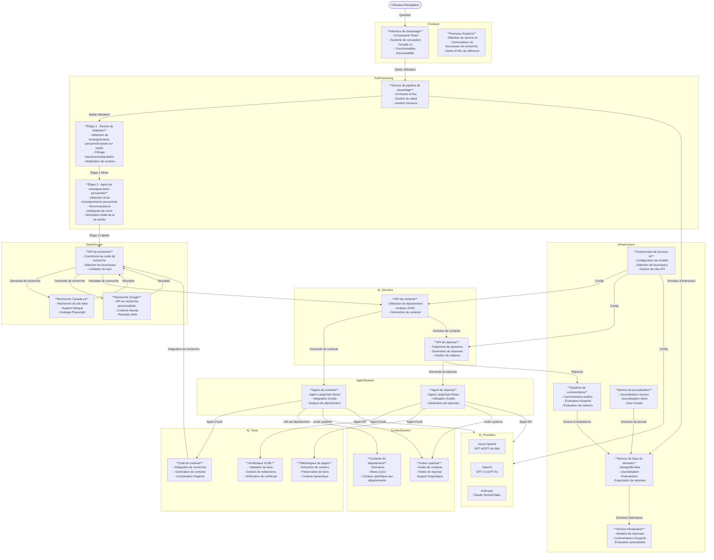

# Réponses IA - Assistant IA du gouvernement du Canada

## Aperçu

Réponses IA est une application de clavardage IA spécialisée conçue pour les sites Web du gouvernement du Canada. Elle fournit des réponses précises et brèves aux questions des utilisateurs sur les services, programmes et informations gouvernementaux, avec une seule citation vers une source gouvernementale officielle ou la prochaine étape de leur tâche. Réponses IA est indépendante du modèle, avec un système d'évaluation innovant qui utilise des évaluations détaillées d'experts humains pour alimenter les évaluations IA automatisées et des réponses précises. Une interface d'administration complète prend en charge les vues d'évaluation, de métriques, de gestion des utilisateurs et de journalisation.

## Documentation du système

Pour des informations complètes sur le système, voir :
- **[SYSTEM_CARD_FR.md](SYSTEM_CARD_FR.md)** - Fiche système complète avec architecture technique, mesures de sécurité, cadre d'évaluation et détails de gouvernance

**English** : [README.md](README.md) | [SYSTEM_CARD.md](SYSTEM_CARD.md)

## Démarrage rapide

### État actuel
- **Environnement** : Préparation pour le projet pilote public
- **Production** : https://ai-answers.alpha.canada.ca
- **Développement** : ai-answers.cdssandbox.xyz

### Caractéristiques principales
- **Réponses contextuelles** : Utilise les URL de référence et la détection de département
- **Système de citation** : Chaque réponse inclut un lien source gouvernemental vérifié
- **Protection de la vie privée et de la manipulation** : Blocage automatique des renseignements personnels, de la profanité, de la manipulation et des menaces
- **Accessibilité** : Testé avec lecteur d'écran et conforme WCAG
- **Axé sur l'évaluation** : Amélioration continue grâce à l'évaluation d'experts et automatisée

### Sécurité et conformité
- **Filtrage du contenu** : Bloque le contenu inapproprié, les menaces et les tentatives de manipulation
- **Limitation du taux** : 3 questions par session pour prévenir les abus
- **Limites de caractères** : Limite de 260 caractères par question
- **Protection des renseignements personnels** : La plupart des renseignements personnels ne sont pas envoyés aux services IA ou enregistrés (certains noms peuvent passer à travers)
- **Langues officielles** : Conforme aux exigences des langues officielles canadiennes

## Architecture technique

### Composants principaux
- **Interface utilisateur** : Interface de clavardage basée sur React avec le système de conception de Canada.ca
- **Serveur** : Microservices Node.js avec architecture de chaînage d'invites
- **Services IA** : Modèles Azure OpenAI GPT (production)
- **Base de données** : AWS DocumentDB (production)
- **Déploiement** : Nuage Azure

## 🌟 Caractéristiques principales

### Adapté aux besoins des utilisateurs de Canada.ca
- La réponse IA est étiquetée pour que les phrases de la réponse puissent être affichées dans un format Canada.ca accessible et qu'une URL de citation unique puisse être affichée pour la prochaine étape de la tâche, avec un lien cliquable
- Suppose que le service IA sera appelé depuis une page Canada.ca spécifique, et utilise l'URL de référence pour transmettre cette information au service IA
- L'invite système force des réponses courtes d'un maximum de 4 phrases pour améliorer la clarté, utiliser un langage simple et réduire le risque d'hallucinations
- Les scénarios traitent des principales préoccupations des utilisateurs, des problèmes de tâches principales et des instructions générales du GC pour que le service IA réponde à la question avec précision et fournisse une URL de citation pour toutes les réponses provenant de sites Canada.ca ou gc.ca
- Tire parti des modèles d'interaction et du support de Canada.ca - par ex. si un assistant est déjà en place, diriger l'utilisateur à répondre à ces questions plutôt que d'avoir le service IA qui tente de répondre
- **Aligné sur les départements** : Les départements peuvent fournir des scénarios d'invite pour répondre aux besoins de communication spécifiques
- Puisque les pages GC sont ajoutées et mises à jour fréquemment, l'agent IA utilise l'outil downloadWebPage pour lire la page s'il identifie une URL nouvelle, mise à jour ou inconnue

### Protection de la vie privée et filtrage du contenu à 2 étapes
- **Étape 1 - Rédaction initiale** : RedactionService filtre la profanité, les menaces, les tentatives de manipulation et les modèles de renseignements personnels courants (numéros de téléphone, courriels, adresses, numéros d'assurance sociale)
- **Étape 2 - Détection IA des renseignements personnels** : L'agent de renseignements personnels spécialisé effectue une détection intelligente de tout renseignement personnel qui a échappé au premier filtrage, particulièrement les noms et identifiants personnels
- Lorsque des renseignements personnels sont détectés à l'une ou l'autre étape, les utilisateurs sont alertés et la question est bloquée pour protéger la vie privée
- La plupart des renseignements personnels n'atteignent jamais les services IA ou ne sont pas enregistrés dans la base de données
- Les numéros de formulaires gouvernementaux, les numéros de série de produits et les codes de référence publics sont explicitement préservés
- Les tests d'utilisabilité de cette fonctionnalité ont montré que les utilisateurs réussissaient à comprendre les instructions et à poser la question sans mots de menace spécifiques

### Support des langues officielles
- Conforme aux spécifications de Canada.ca avec des versions traduites officielles EN et FR de la page principale Réponses IA
- Les utilisateurs peuvent poser des questions dans n'importe quelle langue sur l'une ou l'autre page, mais l'URL de citation sera vers une URL Canada.ca ou gc.ca anglaise si l'utilisateur demande depuis la page Réponses IA anglaise, et vers une URL de citation française si l'utilisateur demande depuis la page Réponses IA française
- Sélecteur de langue également disponible dans le processus par lots
- Le service de contexte charge la structure de menu Canada.ca française et les noms et URLs de départements et agences FR
- Tous les scénarios et mises à jour d'invite système incluent des paires d'URLs de citation anglaises et françaises lorsqu'un scénario ou exemple suggère qu'une URL spécifique soit utilisée pour les questions connexes
- Tout le texte affiché aux utilisateurs dans les fichiers de langue JSON pour des mises à jour et traductions faciles dans le dossier locales

### Indépendance du fournisseur de services IA
- La conception originale a été testée avec deux fournisseurs de services IA pour explorer les forces et faiblesses de différents modèles
- Sur ce dépôt, seul le dernier modèle OpenAI GPT est actuellement supporté
- Un basculement était en place, pour passer à l'autre service IA si l'un échoue - avec un seul service, il faudra retirer le produit du service lorsque les performances IA sont dégradées ou arrêtées. Un paramètre pour l'éteindre et afficher un message est fourni dans l'interface d'administration
- Mise en cache d'invite implémentée pour améliorer la qualité et la vitesse des réponses
- Température fixée à 0 pour des réponses plus déterministes pour les deux modèles
- Gestion de l'historique de conversation - passer l'historique de conversation au service IA pour le contexte dans le champ 'message'
- Gestion améliorée des citations - l'IA appelle un outil pour vérifier si l'URL de citation est valide et sinon, trouve une autre URL, échouant finalement vers un lien de recherche si aucune URL n'est trouvée
- Invites système optimisées pour la compatibilité des modèles 2025

### Conception axée sur l'évaluation (Objectif de >95% de précision des réponses)
- **Système d'évaluation d'experts** :
  - **Évaluation en application** : Les experts évaluent les questions dans l'interface d'application réelle, dans la même vue qu'un utilisateur expérimenterait
  - **Évaluation flexible** : Les experts peuvent saisir leurs propres questions ou utiliser des ID de clavardage existants pour évaluer les conversations d'utilisateurs
  - **Notation au niveau des phrases** : Chaque phrase dans les réponses IA est notée individuellement (100/80/0 points) avec des explications détaillées enregistrées et intégrées dans la base de données pour utilisation par l'IA
  - **Évaluation de citation** : Notation séparée pour la précision et la pertinence des citations (25/20/0 points)
  - **Score total pondéré** : 75% scores des phrases + 25% score de citation pour une évaluation complète de la qualité
  - **Génération d'incorporations** : Les commentaires d'experts créent des incorporations qui permettent des évaluations IA automatisées pour des questions similaires
  - **Amélioration future** : Ces incorporations aideront bientôt à répondre aux questions rapidement et avec précision
- **Commentaires utilisateurs publics séparés** :
  - **Interface simple** : "Cela était-il utile ?" avec options Oui/Non pour tous les utilisateurs
  - **Suivi détaillé** : Question unique demandant pourquoi ils ont cliqué Oui ou Non avec des options de raisons spécifiques
  - **Raisons positives** : Aucun appel nécessaire, aucune visite nécessaire, temps économisé, autre
  - **Raisons négatives** : Non pertinent, confus, pas assez détaillé, pas ce qu'ils voulaient, autre

### Fonctionnalités d'accessibilité
- Des sessions d'utilisabilité ont été tenues avec des personnes qui dépendent d'une gamme de technologies d'assistance de lecteur d'écran pour identifier les améliorations qui répondaient à leurs besoins
- Notez que la réponse est formatée et complète avant d'être affichée ou annoncée - pas de diffusion en continu
- Étiquettes Aria pour un contexte utile, utilisation d'Aria-live pour annoncer les réponses et messages d'erreur

## Architecture technique

### Architecture de microservices avec chaînage d'invites
- **Architecture de chaînage d'invites** pour améliorer la qualité et la vitesse des réponses [voir diagramme](#diagramme-darchitecture)
- **Agents LangChain React** pour la génération de contexte et de réponses avec intégration d'outils
- **Chaîne de pensée** - le service de réponse génère des vérifications préliminaires pour aider à dériver les réponses, incluant :
  - Traduction de questions non-anglaises vers l'anglais
  - Collecte d'URLs de citation possibles du service de contexte et des invites système
  - Analyse de département et de sujet
  - Vérification et validation du contenu
- **Utilisation d'outils agentiques** - Les agents IA peuvent utiliser de manière autonome des outils spécialisés pour améliorer les réponses
- **Support multi-fournisseur** - Modèles Azure OpenAI (production), OpenAI et Anthropic Claude

### Utilisation d'outils agentiques
L'application utilise des agents LangChain React avec des outils spécialisés pour améliorer les interactions IA :

- **Outil de recherche Canada.ca** - Effectue des recherches sur les sites Web gouvernementaux
- **Outil de recherche de contexte Google** - Fournisseur de recherche alternatif pour un contexte plus large
- **Vérificateur de statut d'URL** - Valide les URLs de citation avant de les inclure dans les réponses
- **Téléchargeur de pages Web** - Télécharge et analyse le contenu des pages Web pour la précision
- **Outil d'agent de contexte** - Coordonne la génération de contexte et l'analyse de département

Pour des informations détaillées sur l'architecture agentique et l'intégration d'outils, voir la [Fiche système](SYSTEM_CARD_FR.md#utilisation-doutils-agentiques).

## Fonctionnalités d'administration

### Gestion des utilisateurs
- Gestion des rôles d'administrateur et de partenaire
- Création, modification et suppression d'utilisateurs
- Contrôle d'accès basé sur les rôles

### Traitement par lots
- Évaluation IA en vrac avec téléchargements CSV
- Surveillance et gestion des lots
- Support multi-fournisseur (OpenAI, Anthropic)

### Gestion de base de données
- Capacités d'exportation/importation
- Statistiques et maintenance des tables
- Surveillance du système et analytiques

### Métriques de performance
- Analytiques et rapports en temps réel
- Tableau de bord des journaux de clavardage
- Contrôles de configuration du système

### Chargement de contexte spécifique aux départements
- `scenarios-all.js` - Toujours chargé avec des scénarios généraux pour tous les départements
- Fichiers de scénarios et mises à jour spécifiques aux départements chargés si disponibles
- Situés dans les dossiers de contexte dans [`src/services/systemPrompt/`](src/services/systemPrompt/)
- Assure les scénarios généraux comme base avec des ajouts spécifiques aux départements

## Développement

### Gestionnaire de services IA
**Configuration de modèle** (`config/ai-models.js`) - Gère les clés API, points de terminaison et configurations de modèle pour chaque service IA
- **Azure OpenAI** (production) - Modèles GPT-4 et GPT-4o Mini
- **OpenAI** - Modèles GPT-4.1 et GPT-4o
- **Anthropic** - Modèles Claude Sonnet et Haiku

## Contribution

TODO : Directives de contribution et code de conduite pour des détails sur comment participer à ce projet.

## Diagramme d'architecture

Pour des informations détaillées sur l'architecture technique, voir la [Fiche système](SYSTEM_CARD_FR.md#architecture-technique).